I've never been to a lot of good theme parks in my life. I went to some amusement parks in Missouri growing up, but the only theme park I've been to was Silver Dollar City in Branson. So compared to all that, Universal Studios Japan was so... cool... Especially with Nintendo World? Going to a park where the characters and theme is something you actually care about is awesome. Apparently there was even a Minions area that I never went to??

# Mario Kart: Bowser's Challenge

I bought an express pass because I couldn't seem to buy a normal area entry ticket for Nintendo World. My pass was only valid for very specific times of the day, but as with all things, I was running late. By the time I got in line for Mario Kart: Bowser's Challenge, I was literally seconds away from getting rejected. And thank god I didn't. The normal line was like 2 hours long?? Which is like normal in Japan lmao??

The ride was AR Mario Kart where you're on a fixed path, but you get points for steering at the right times. You'd pickup item boxes and shoot green shells at your AR opponents. The AR thing made it so cool because unlike the real world, everyone in the kart was seeing a different reality, so it's not like I could see my teammates green shells. It kinda felt like I was the only person in the kart. 10/10 no notes, it really did feel like you were in Mario Kart in real life highk.

# Kinopio's Café

*Immediately* as I left the ride, I received frantic messages from Vivi saying that I needed to get to the Toadstool Cafe within the next like 30 seconds or I'd miss the reservation. Just like last time I clutched up and we all got seated and uh yeah, we ordered like the whole menu lMAO.

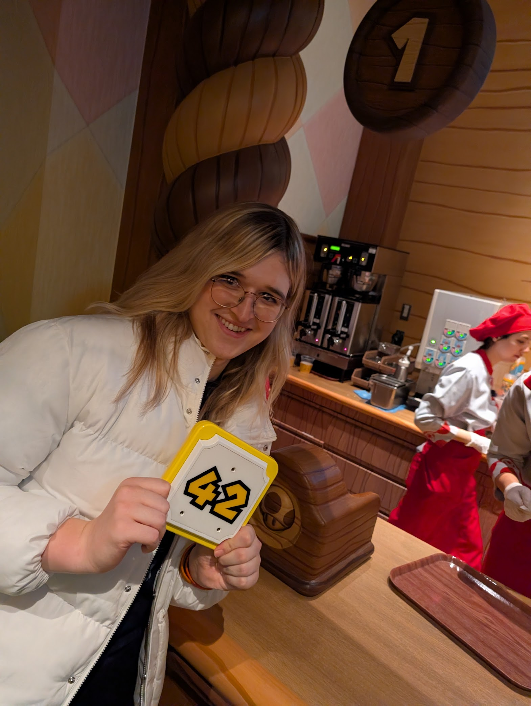
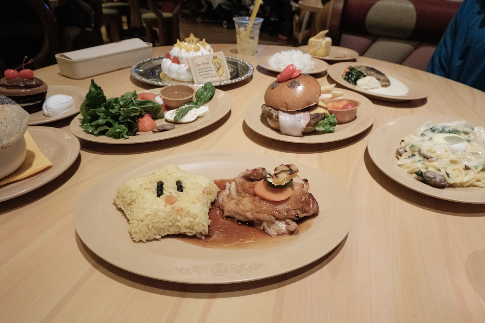
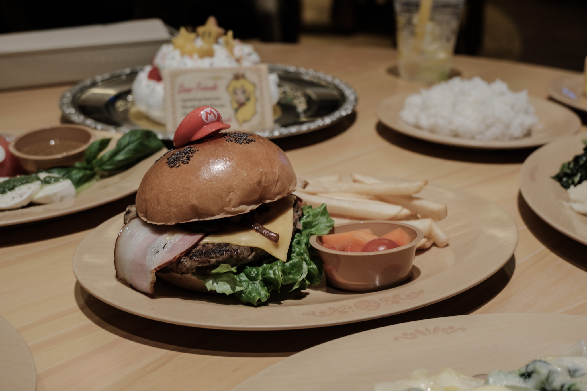
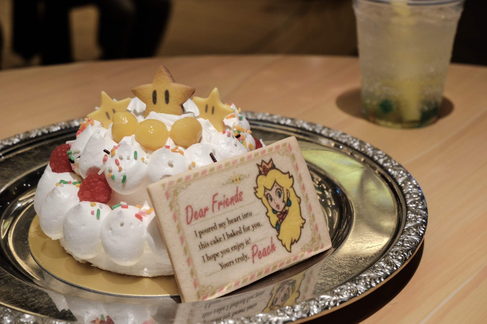
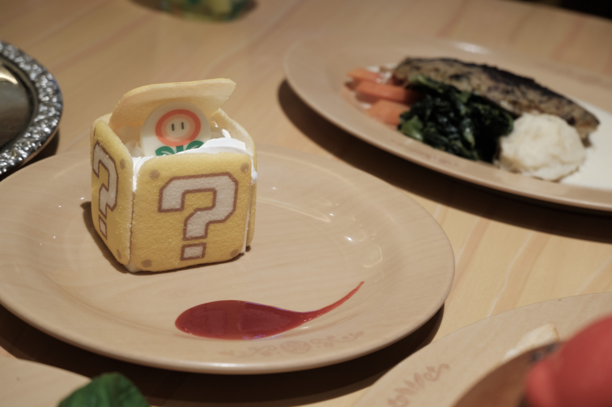

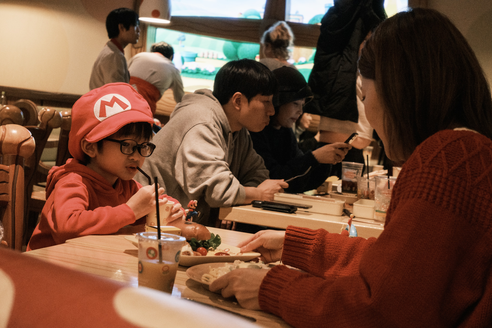

# Gift Shop

With our bellies filled up, we stopped by the gift shop and Vivi bought two HUGE bags of merch. I don't understand but pop off queen. I should have bought these ear muffs but I'm fucking STUpid.

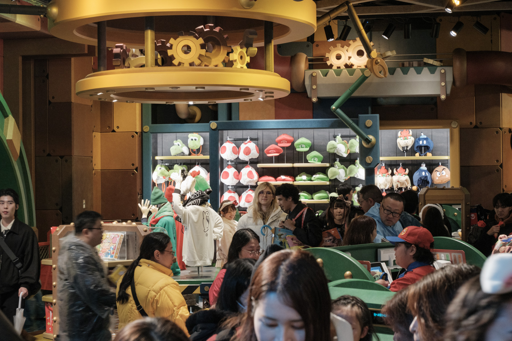
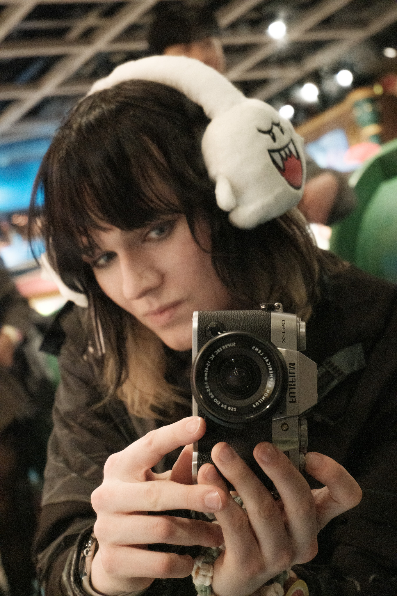

# Walking and Vibing

The park had recently opened a Donkey Kong Country themed area, but the roller coaster was out of operation today. At least it was cute to walk around. I cannot explain how bizzare all of this felt. Nothing felt real, it all was legit a different dimension.

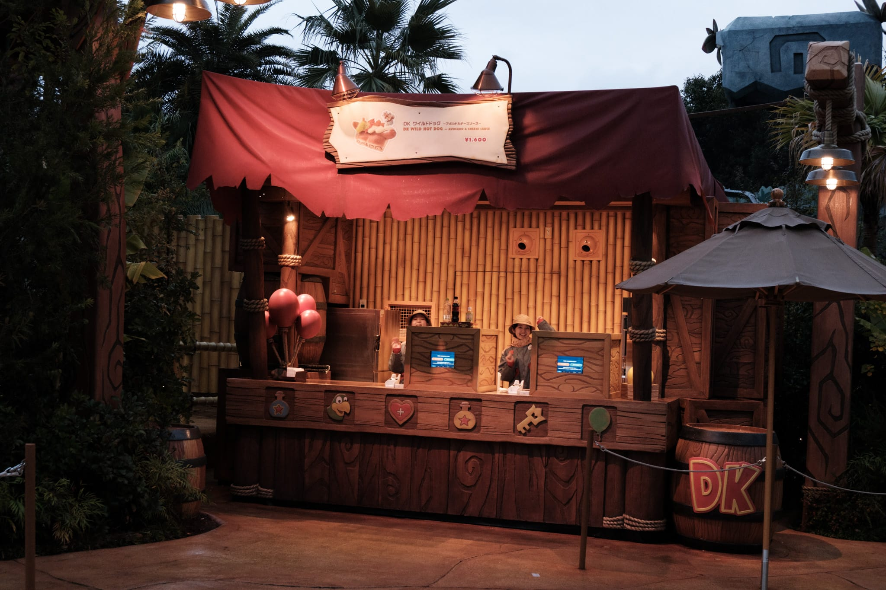
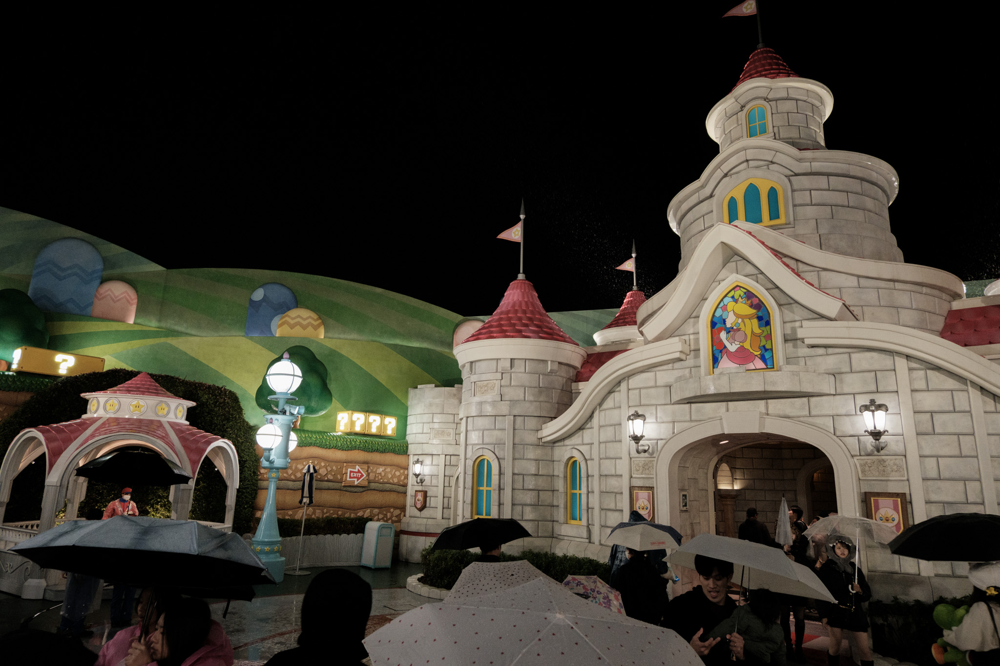

# Yoshi's Island Adventure

As it got dark, it started raining all night. Before we headed out, we rode on Yoshi's Island Adventure, which is exclusive to Japan. It was meant for kids, but it was perfect because they let me take my camera on it. Unfortunately I could only take photos on the indoor sections.

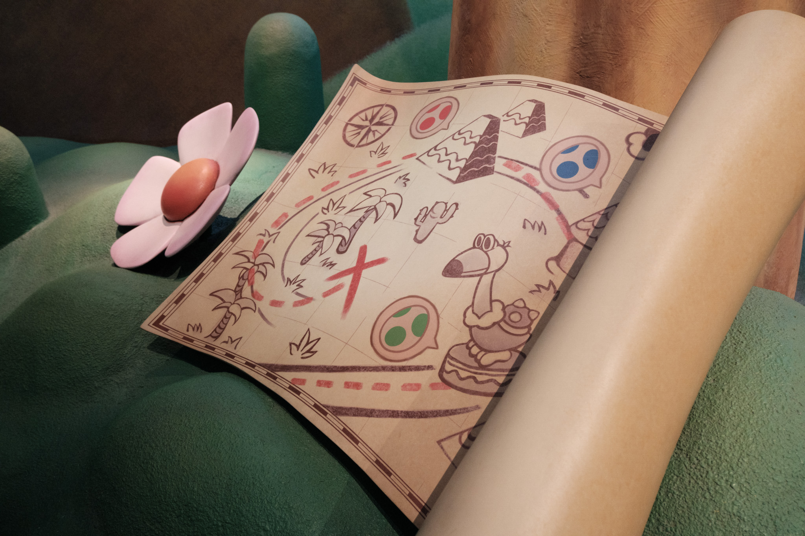
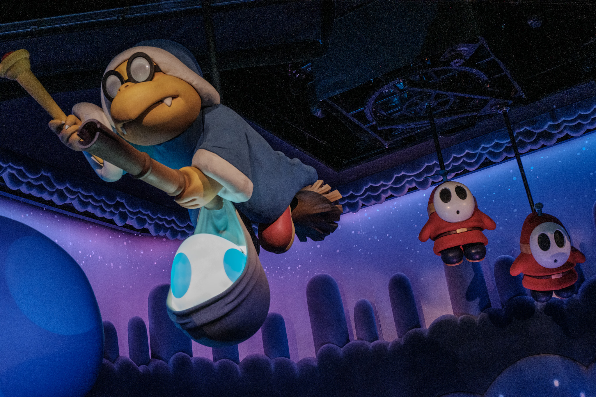
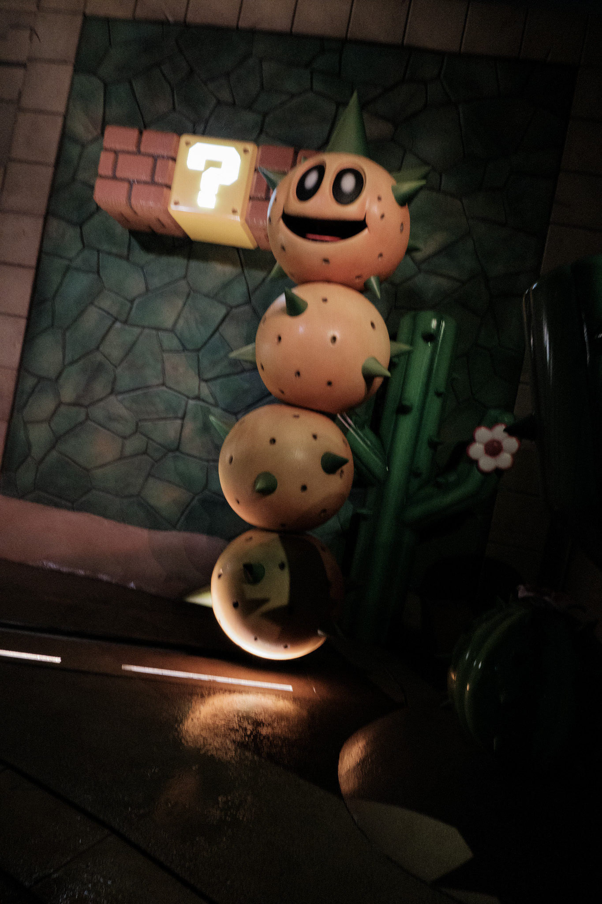

# Skipping the Line Because We’re Pretty

Since it was raining, all the rides had like no lines. We went on the Jurrasic Park ride which honestly was heat. Highly recommend. Then we waiting in line for JAWS, but the line never moved and they cancelled the ride. Fortunately they did give use a free universal Express Pass which we used on the longest line: Hollywood Dreams. Super happy to actually go on a roller coaster finally. It was the perfect way to wrap up the day!

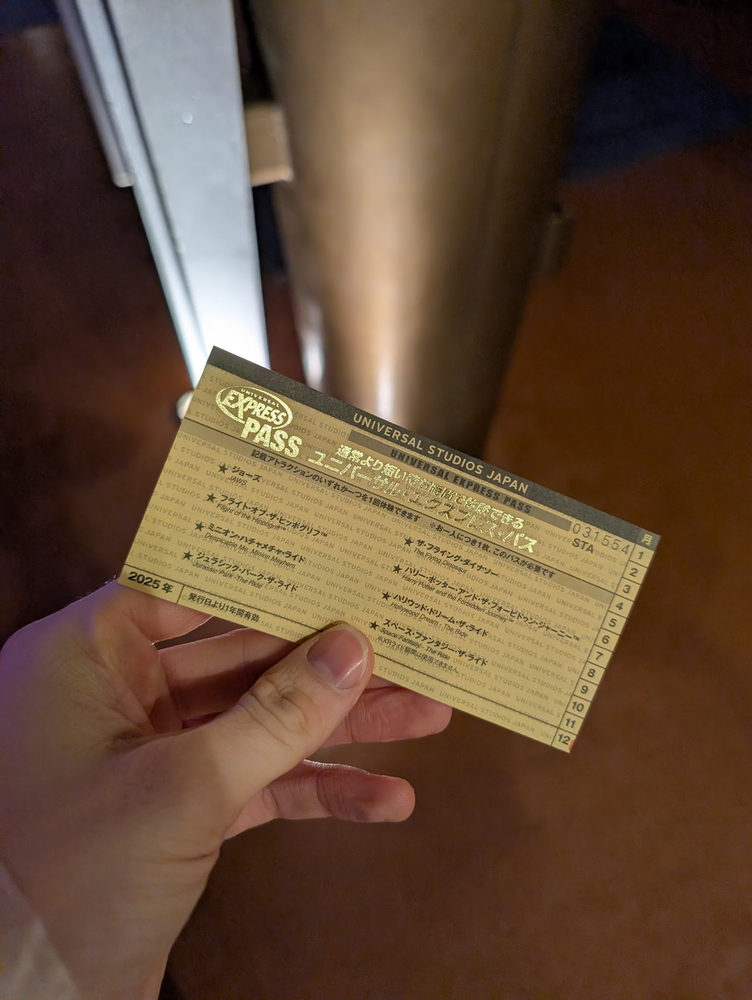

# Goodbye Osaka

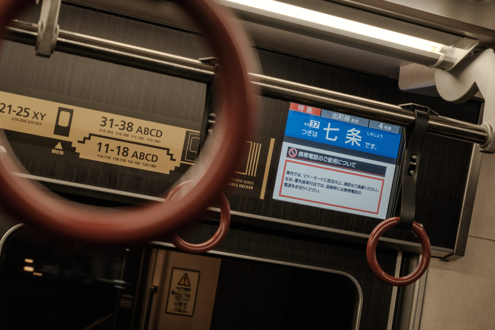
