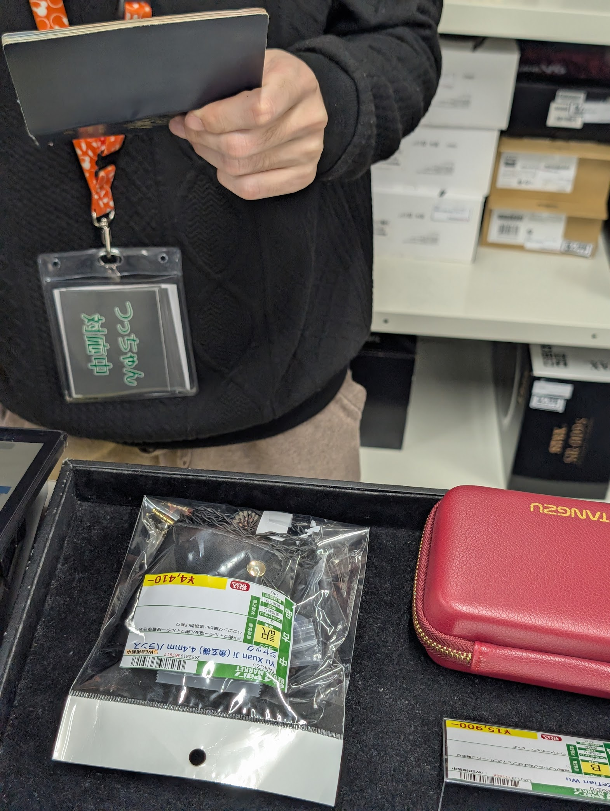
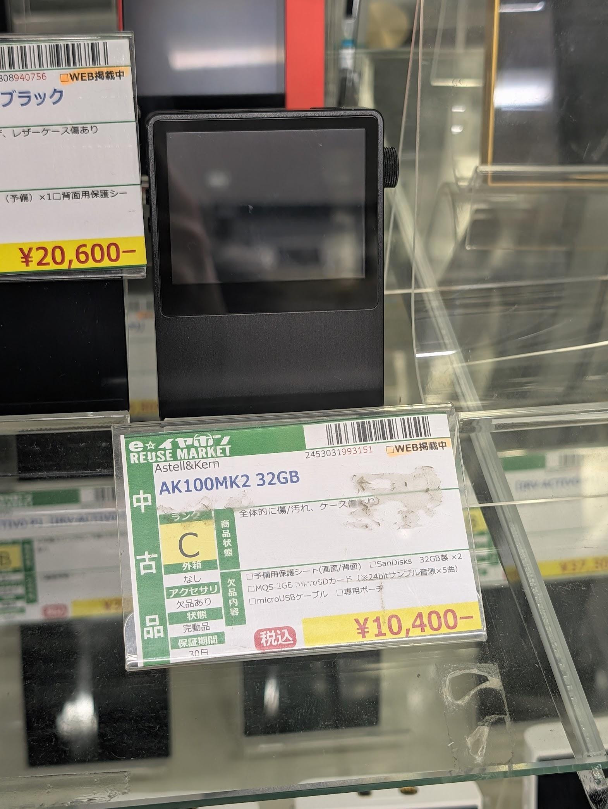
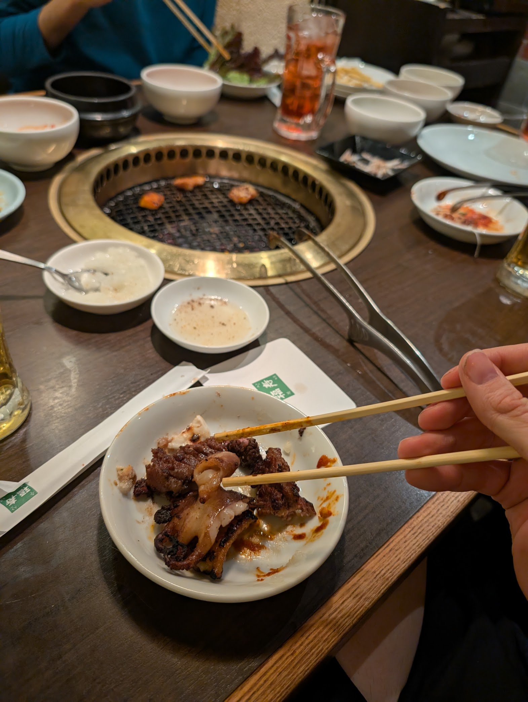

# IEMs

I got a new hotel for the next three days, and went back to e-Earphone after checking-in to buy some IEMs. Historically I'm a bit of an audiophile, but I'll admit that IEMs are a bit of a weakspot in my knowledge, so I just did a bunch of research on the pretty looking ones they had in stock. I think I found some cute ones. No spoilers tho.

I've also been meaning to buy a DAP. Unfortunately the market has consolidated to what are essentially just android phones which is cringe. I'm looking for something with quirky hardware, but they didn't have much.

# KBBQ

Vivi and Cardia were in the area, so we got dinner together and an All-You-Can-Eat & All-You-Can-Drink place. It was really nice!

Goodnight everypony

