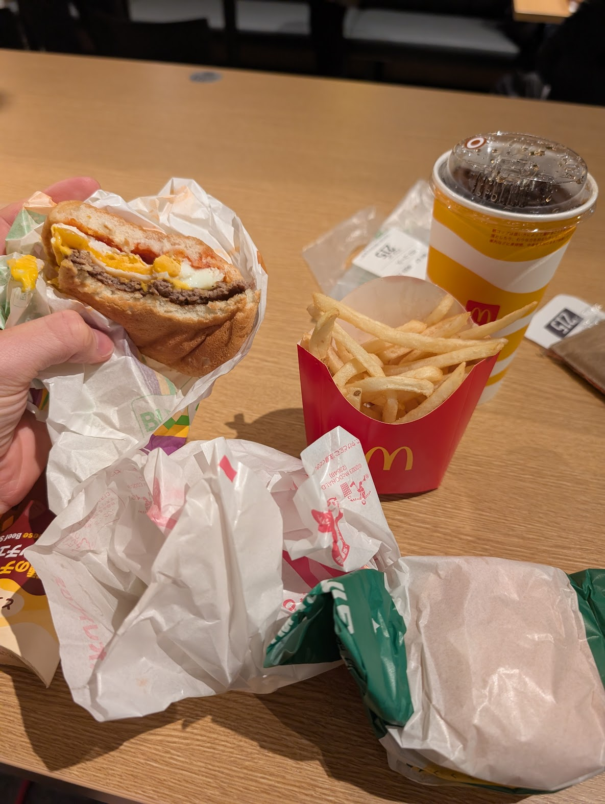
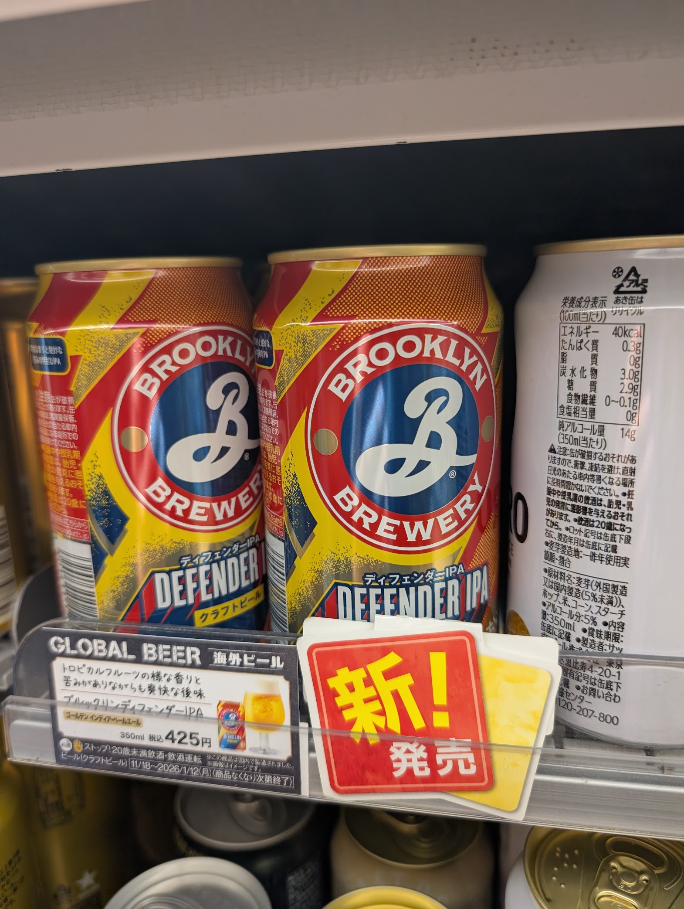

# Hyperfixations

I have strong fixations on certain types of tasks, and this time, they had me staying up two nights in a row playing toys on my laptop :)))) I setup a Lightroom workflow, refactored my website, migrated to Notion, fucked around with MacOS emulators. It's nice to have the space to work on cool stuff without the pressures of life or work. The world stood still for a couple days and it felt very nice.

I've learned to embrace times like these. I no longer carry the same shame about my fixations like I once did, and I owe it to someone really important to me.

# McDonalds

In other news, McDonalds here is weird af. Would not recommend the shrimp burger if you have any amount of self respect.

Also they just have Brooklyn Brewery here super casually and it's like in every konbini ever.

