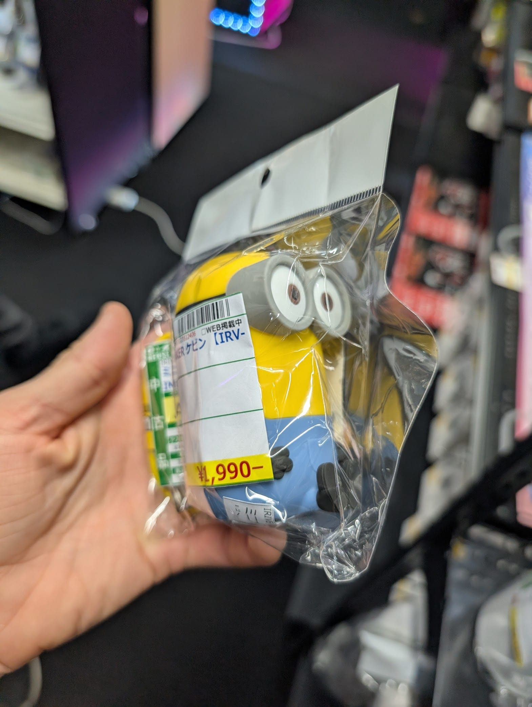
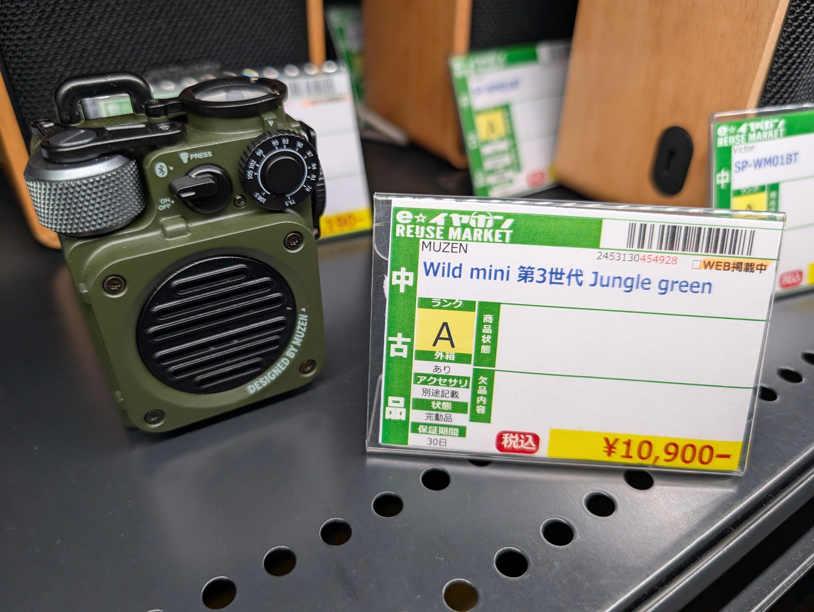
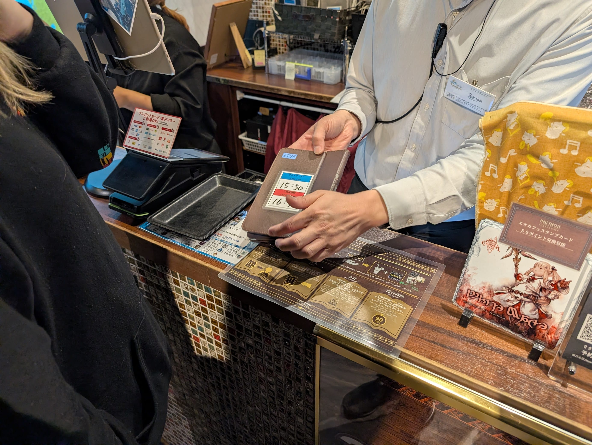
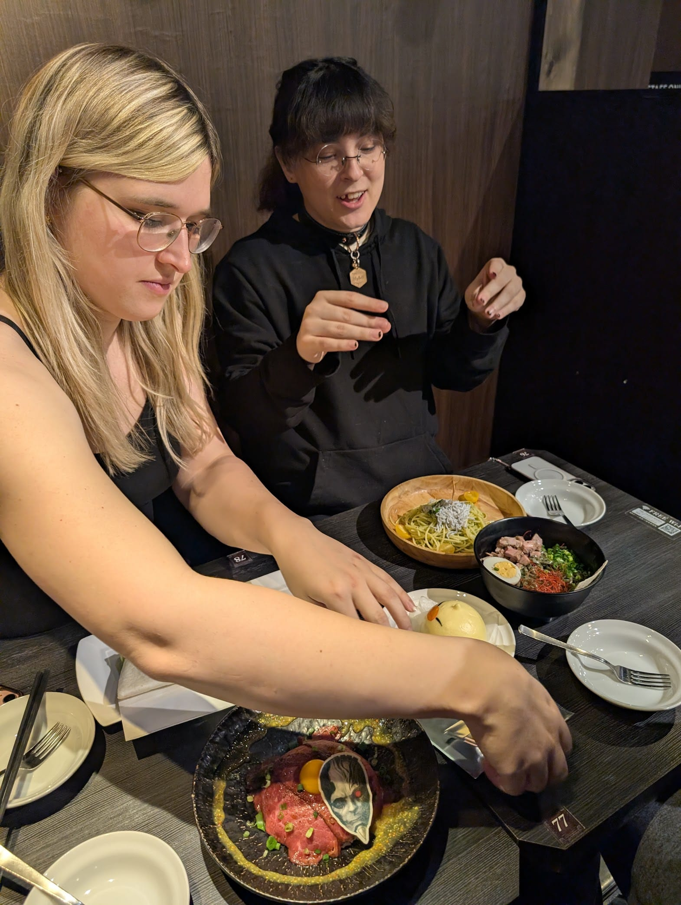
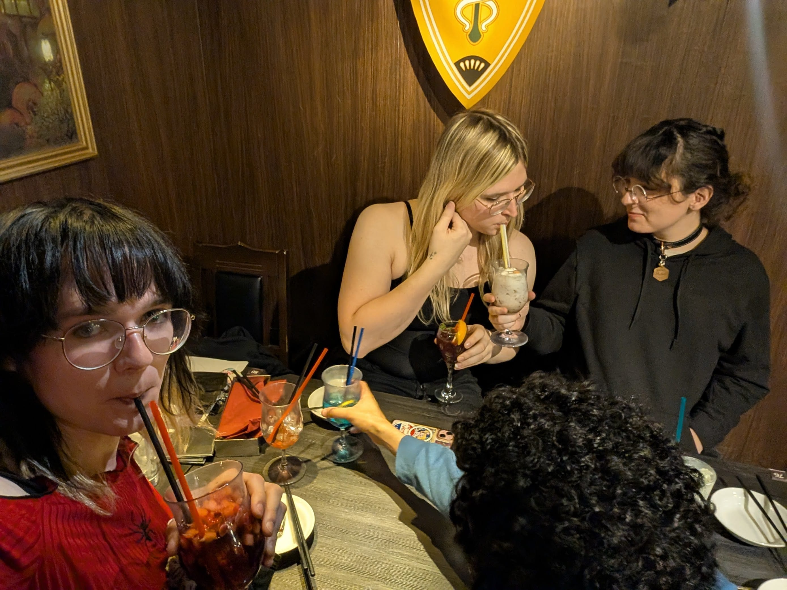
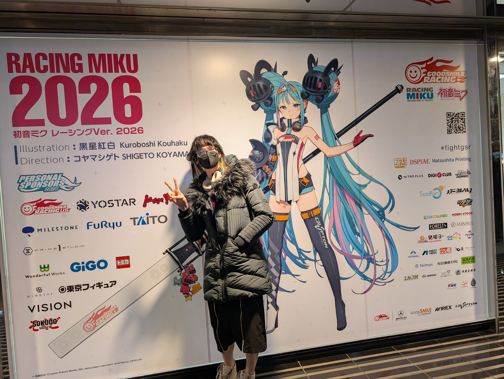
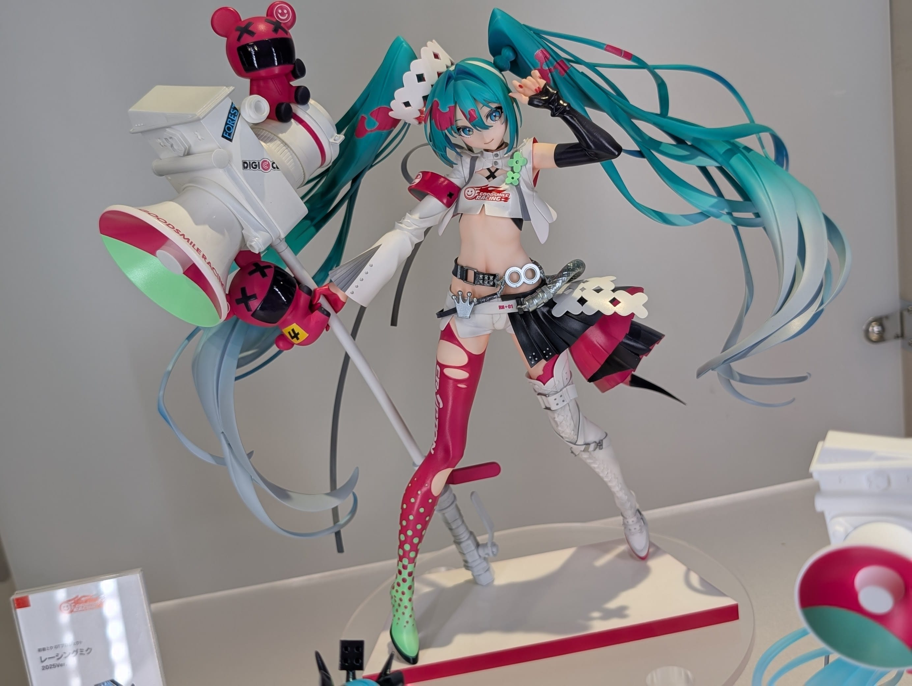
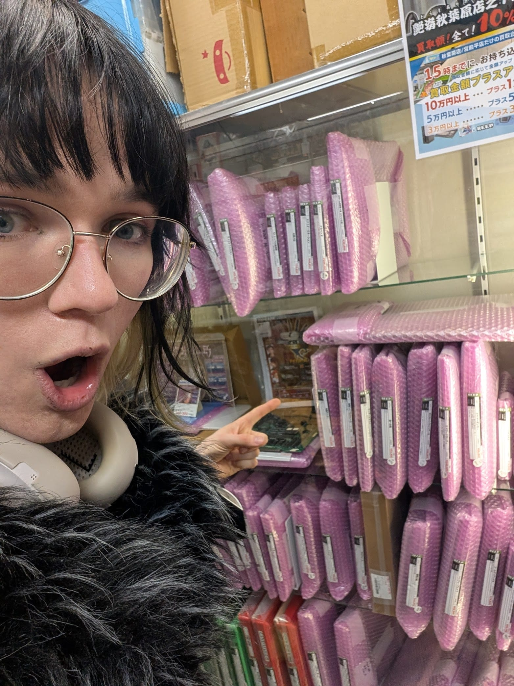
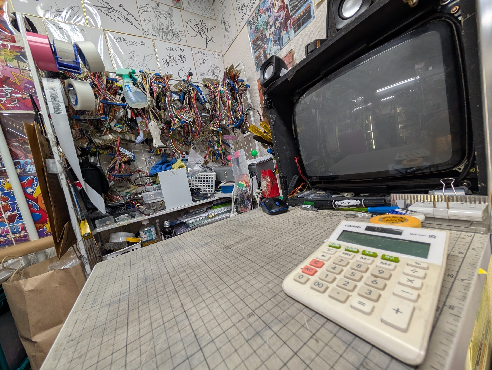
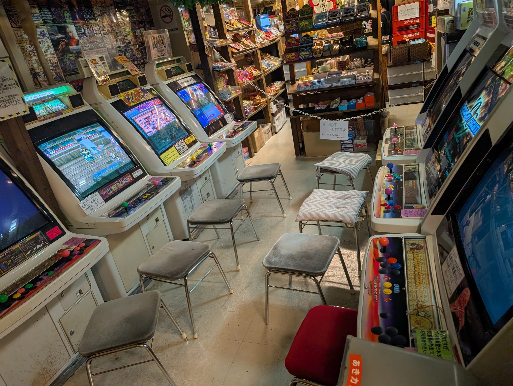

Today, we had a reservation at the Final Fantasy cafe in Akihabara, so we spent the whole day in the area. I've been looking forward to see how the place has changed since I was last here. I was such a weeb when I studied abroad here, so I knew all the good places. I took everyone to e-Earphones to find a replacement to my Moondrop Arias. I was unfortunately overwhelmed by all the options and how busy the place is but here's some cute shitty bluetooth speakers I found:

The Final Fantasy cafe was delicious and super pretty. My favorite part was all the drinks. Lily knows EVERYTHING about FF, so it explained how all the dishes and drinks connect to the lore. I had so much fun! 

After an early dinner, I wanted to check if the Akiba CO Gallery was doing an exhibition and HOLY SHIT I could not have come on a better day!! It was the *opening day* of the Racing Miku 2026 exhibit and I got to see the grand reveal of this year's design. It's mid lowk, but fortunately most of the merch was from the 2025 Racing Miku, which is one of my favorite designs from one of my favorite artists Kei Mochizuki (https://twitter.com/key_999). At the event, they also revealed a new figurine for the 2025 Miku and I fell in love. I will buy this at ALL COSTS!!!

The concept of Racing Miku is so cool. I love it when they throw money at artists to do cool things!

We continued to scour Akihabara for all my favorite shops: BEEP Akihabara, Super Potato, Akibaoh 3rd Shop, Mandrake... It felt so overwealming trying to find what I want, so next time I'll come back with a shopping list :3

Such a fun day! I was so exhausted when I got home :)