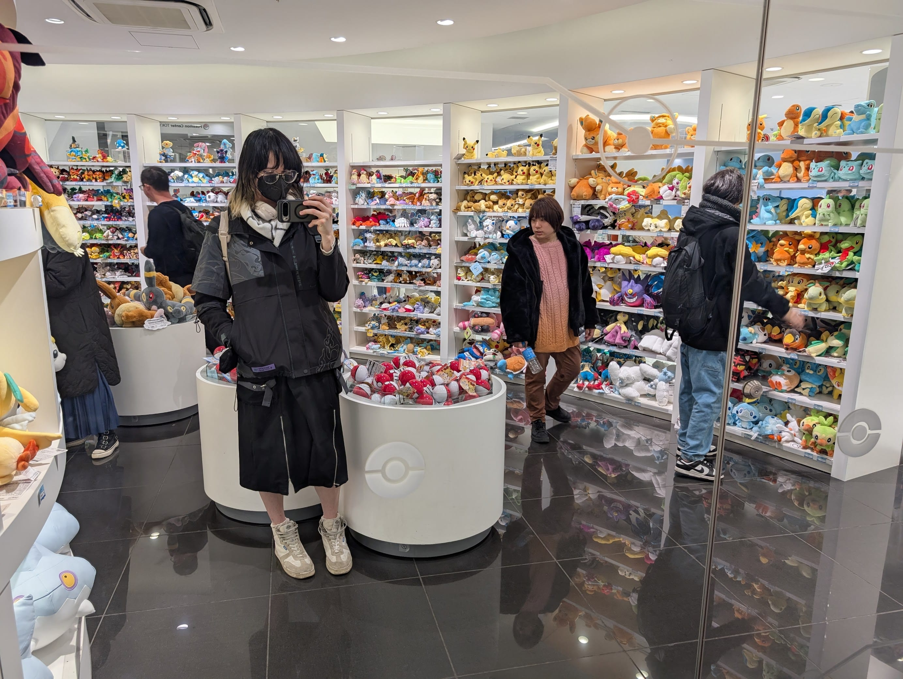
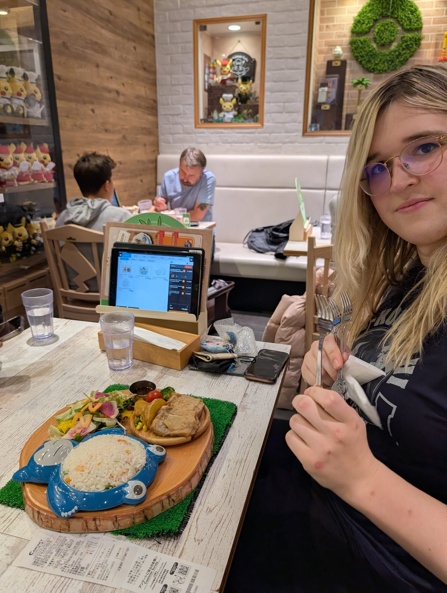
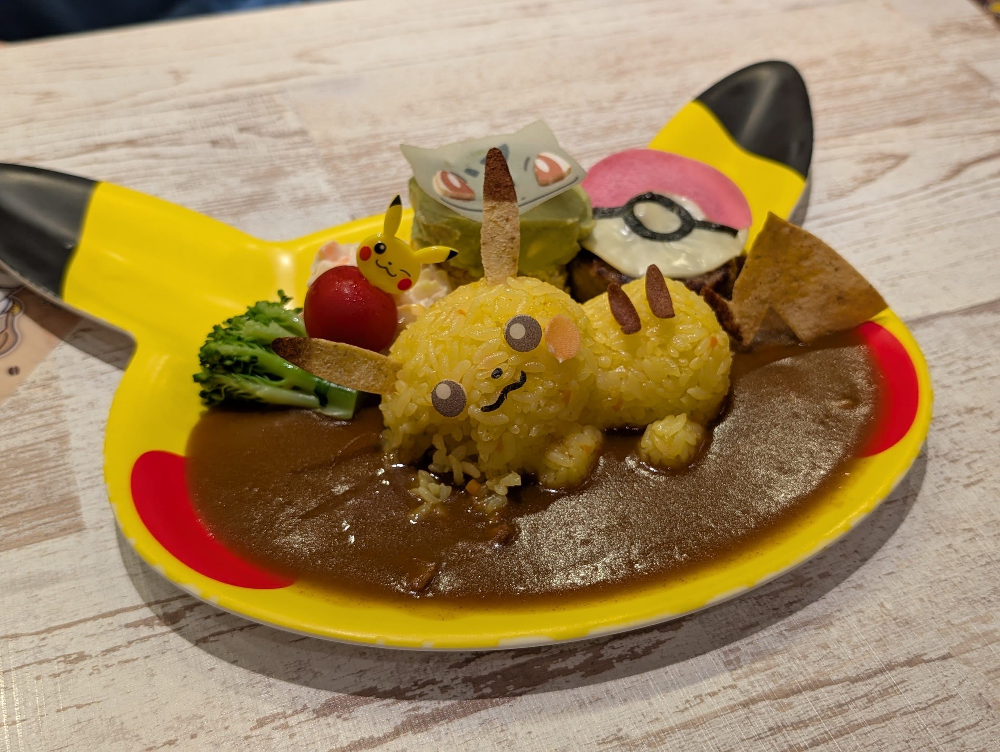
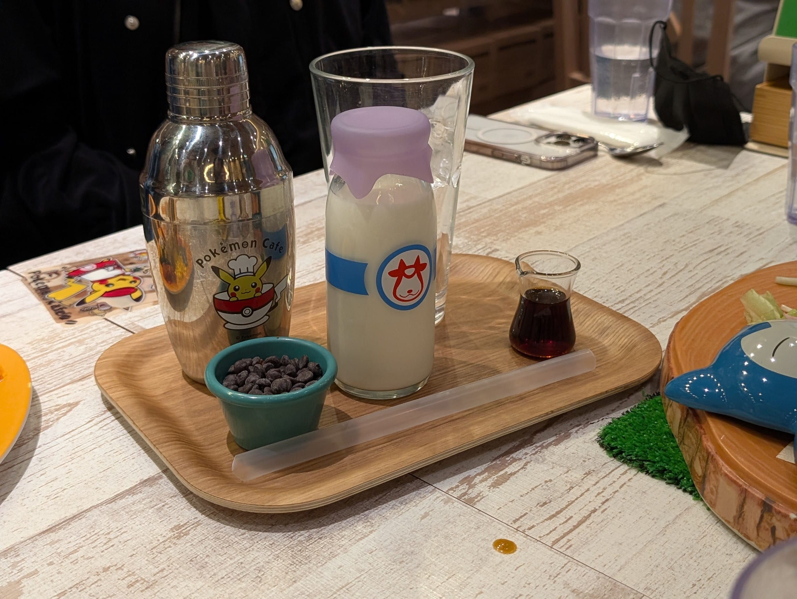
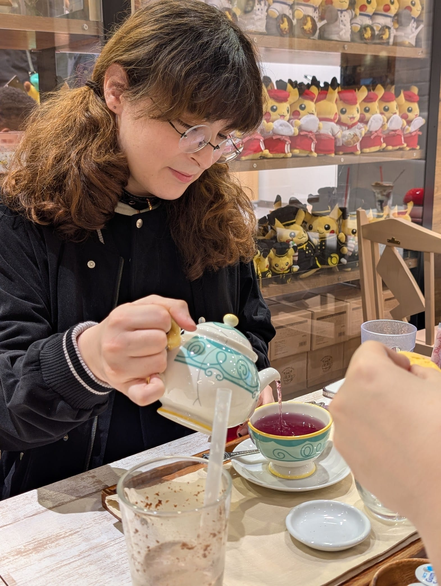
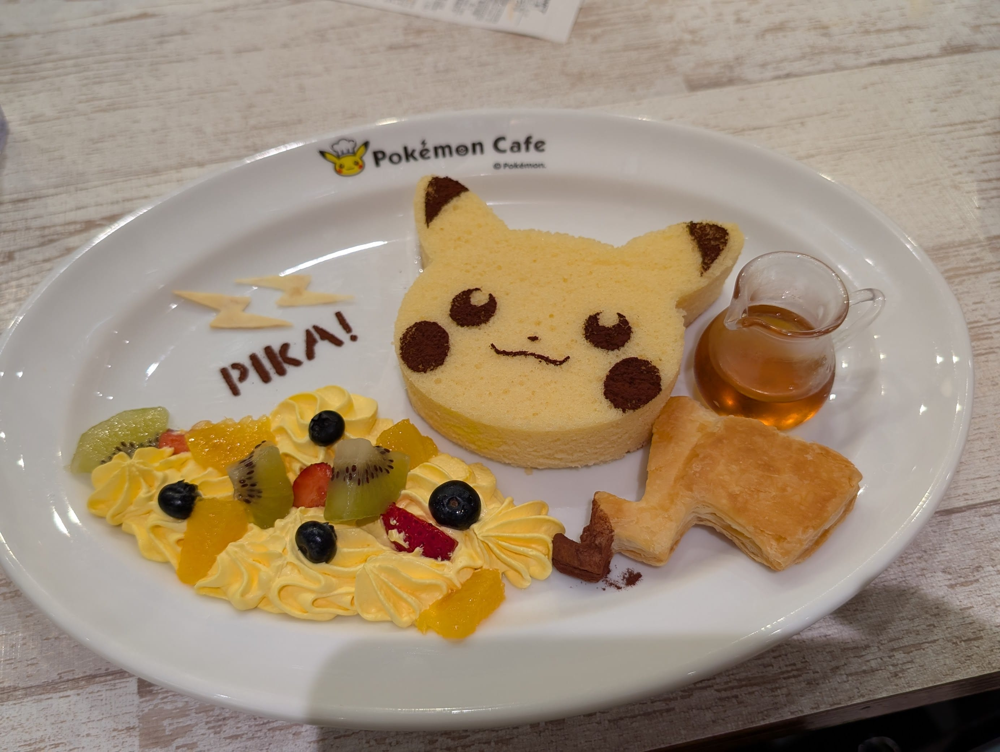
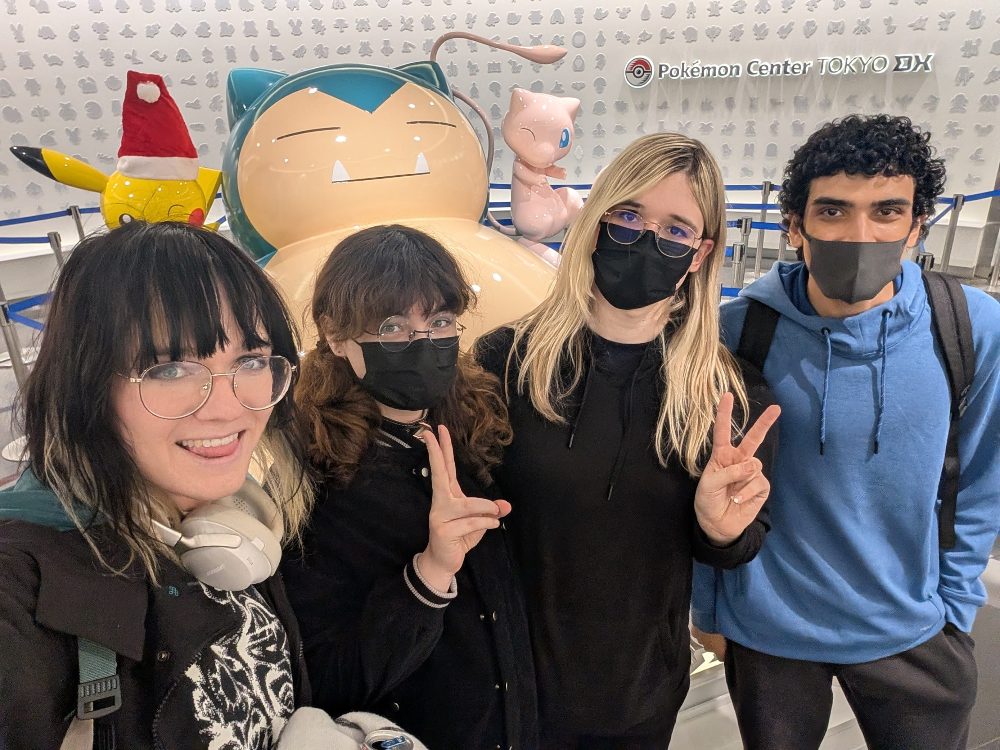
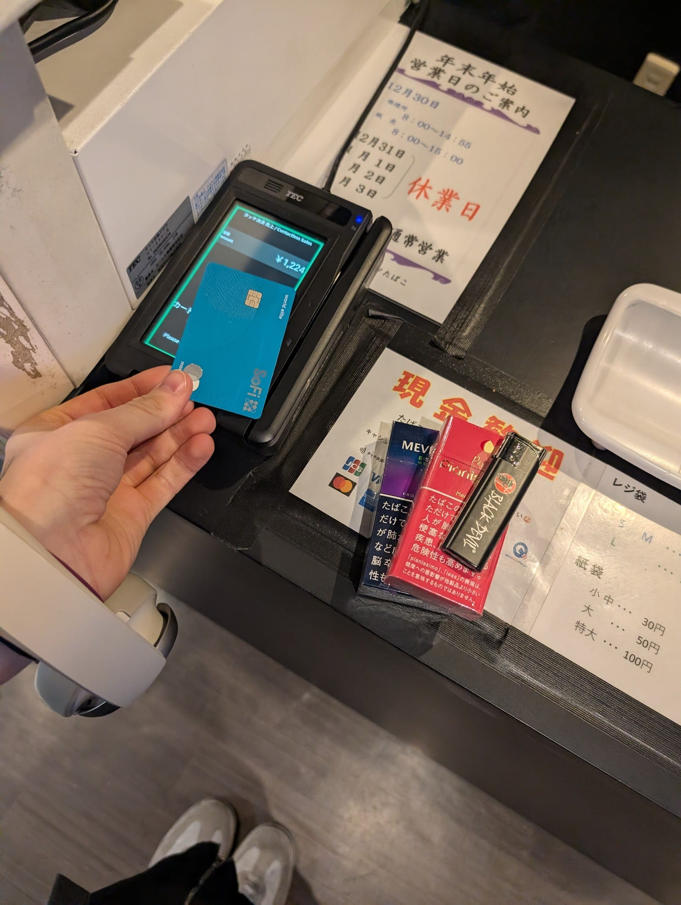

Today is our reservation for the Pokemon Cafe, so we headed over to Nihonbashi beforehand to look around. We only had time to wander the rooftop of the building and check out the gift shop before getting seated.

# Pokemon Cafe !!

I didn't really have the appetite since I had an upset stomach, but the experience was still really fun!

# Smokes

After a brief pitstop home, I took the train to Mimatsu tobacco in Akihabara to get some flavoured cigs. Outside of menthol, flavored cigs are illegal in the US, so I wanna get the download on the good ones so I can bring a few cartons back. Cheers to my future crippling nicotine addiction :3

I bought a pack of Mevius Option Purple 1 and Pianissimo Peach Mint.

You can only smoke it designated areas here, but I couldn't find any on the way home so :(

Goodnight