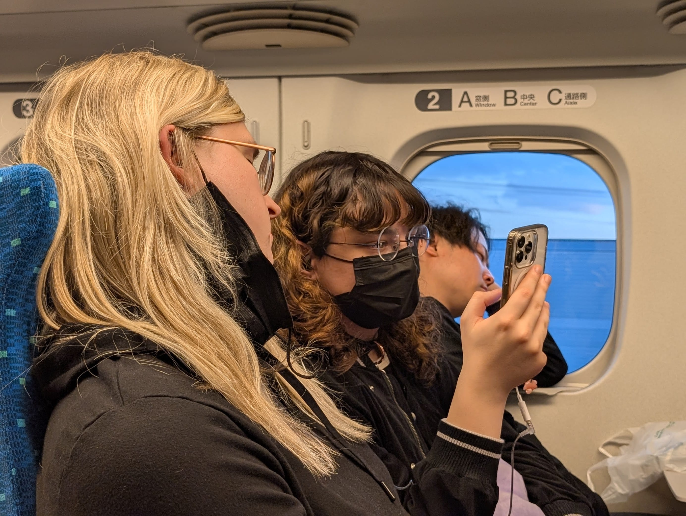
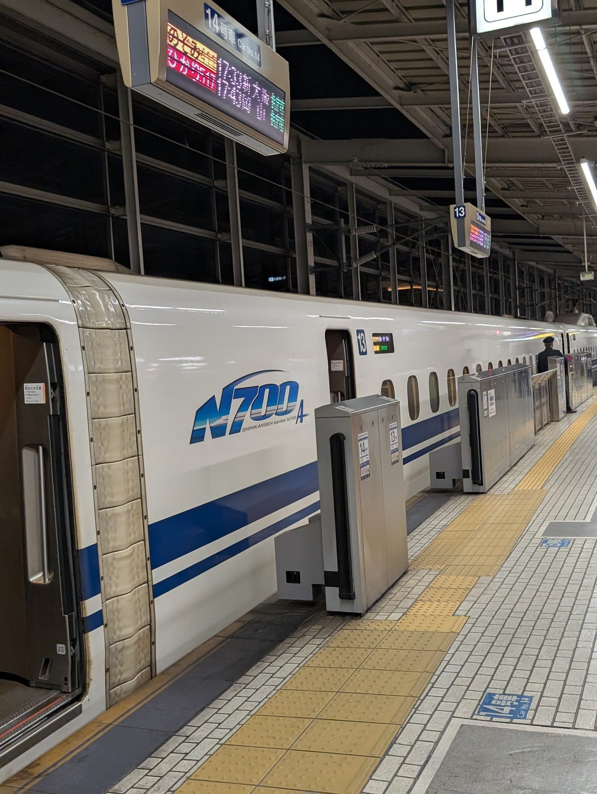
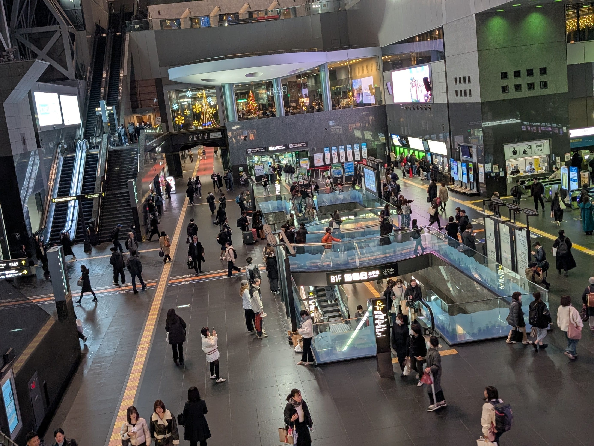
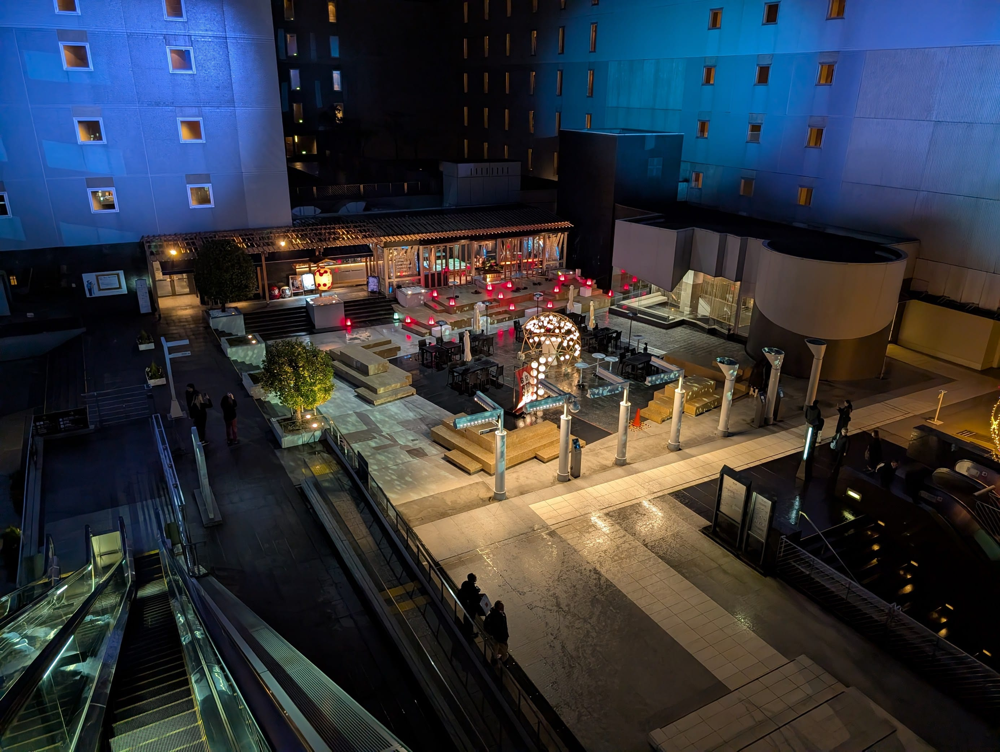
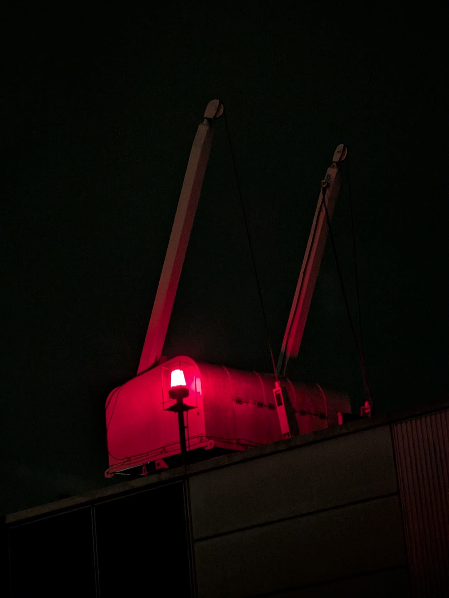
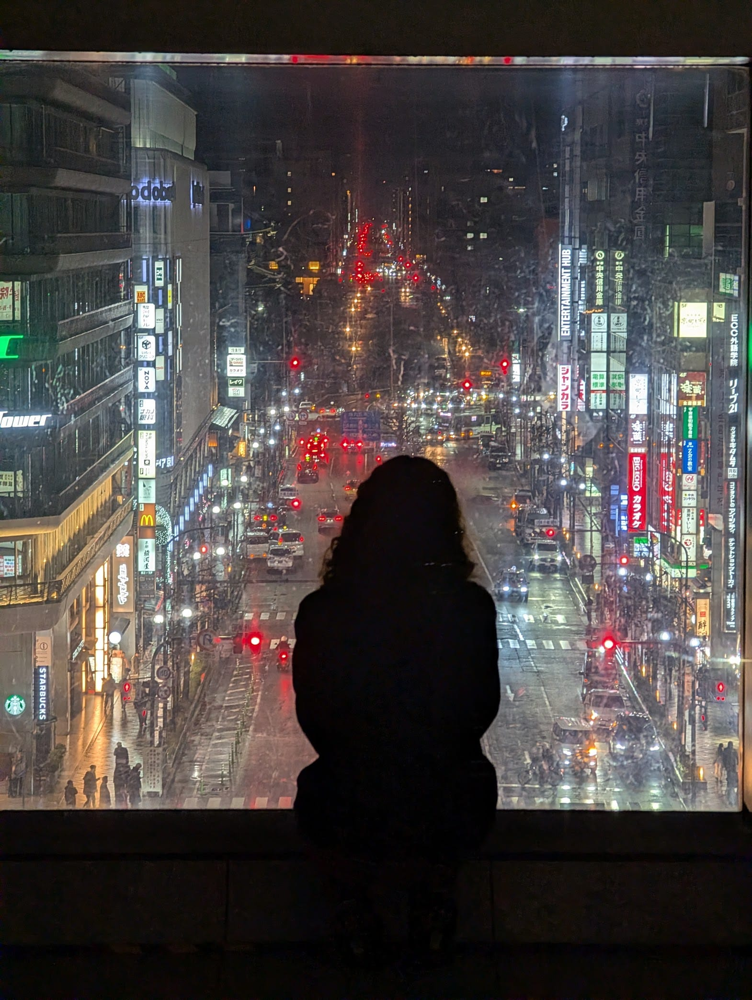
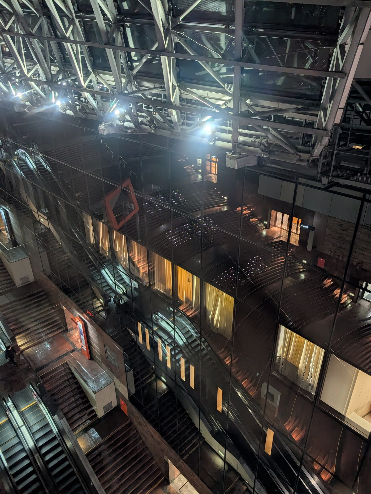

Took the day to travel to Kyoto. Took the shinkansen, explored Kyoto Station, and got cucked on my hotel again :smile:

# Shinkansen

I checked out of my hotel and met the others at theirs. Before heading out, we ate a delicious lunch at ASIAN INDIAN RESTAURANT NEW SARATHI before boarding the shinkansen for Kyoto.

# Kyoto Station

But first a donut break!

I made sure we got out of the station and walked around. It's literally a playground for photography i stg. Unfortunately my phone camera isn't good enough for such low light, so here's all I got:

# Fucked up hotel AGAIN

Apparently Vivi sent me the wrong hotel to book, so I was staying multiple miles away from everybody else. This is the *second* time we've miscommunicated on hotels, but maybe it's fine because my hotel is way nicer LOL.

Okay I say that, but they did fuck up and forget to send me check-in info, so I did wait an hour in their lobby for them to email me back. We move on and we move regardless.
