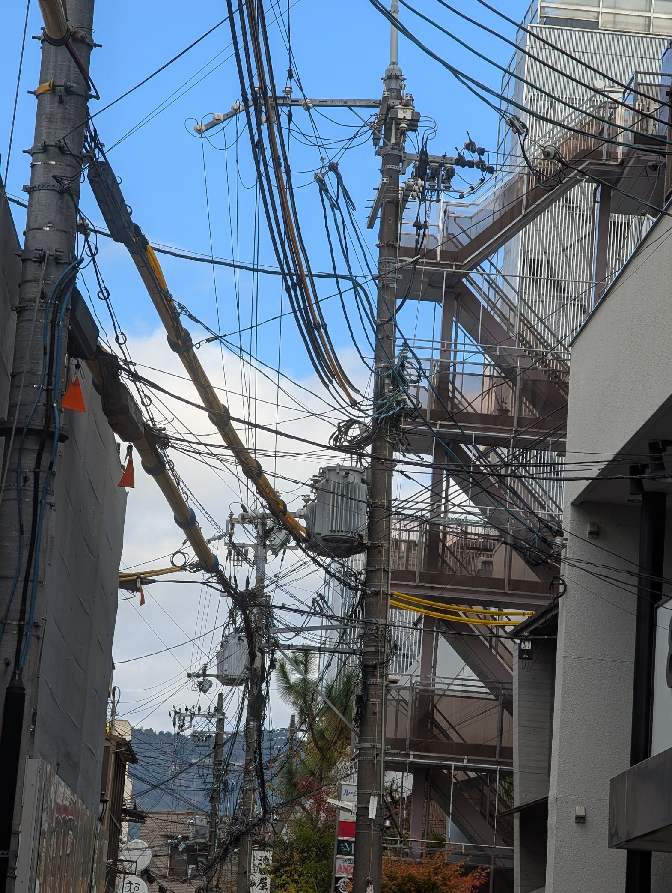
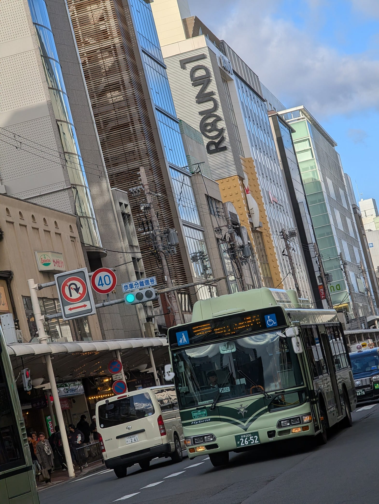
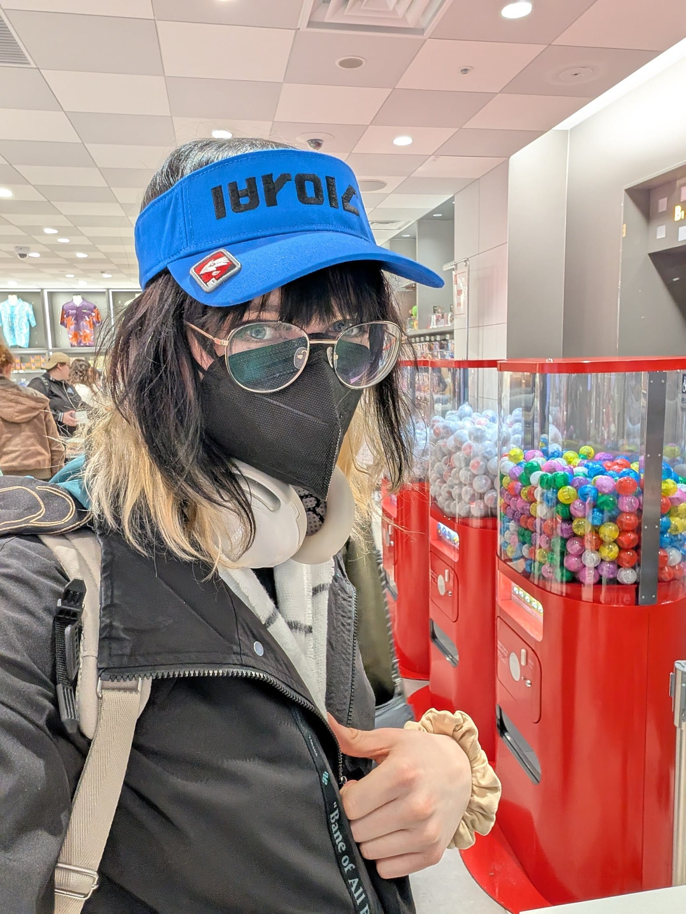

# Blogging is soul sucking work so you better be happy
Imma be so real with yall, I spend like 1-2 hours daily on this blog, and since I didn't get the time yesterday, I had to spend 3 hours of Kyoto daylight on this stupid thing. I hope you're happy!!!

But this is nothing compared to the deraged level of detail I journalled in the first half of 2025. As difficult as it may be, journalling makes everything you do feel so very important in a way you've never experienced before until you have. The euphoria of having everything I ever did written down to the best of my recollection drove me to the brink of insanity. I'll do a whole write-up on my website sometime! It's one of the coolest things I've ever done.

# Nishiki Market

After a long morning in bed, I headed out on the town with a simple mission: buy an SD card for my new camera. As scoured the shopping district, an androgynous aura lured me into a designer clothing store and pilfered me for all I'm worth (I didn't take pictures but trust me).

I met the gang at Nintendo Kyoto and spent a good $50 on gamecube stim toy gatcha. I also got a splatoon visor and a banana wallet.

Sorry I forgot to take a lot of pictures today and I regret it.
